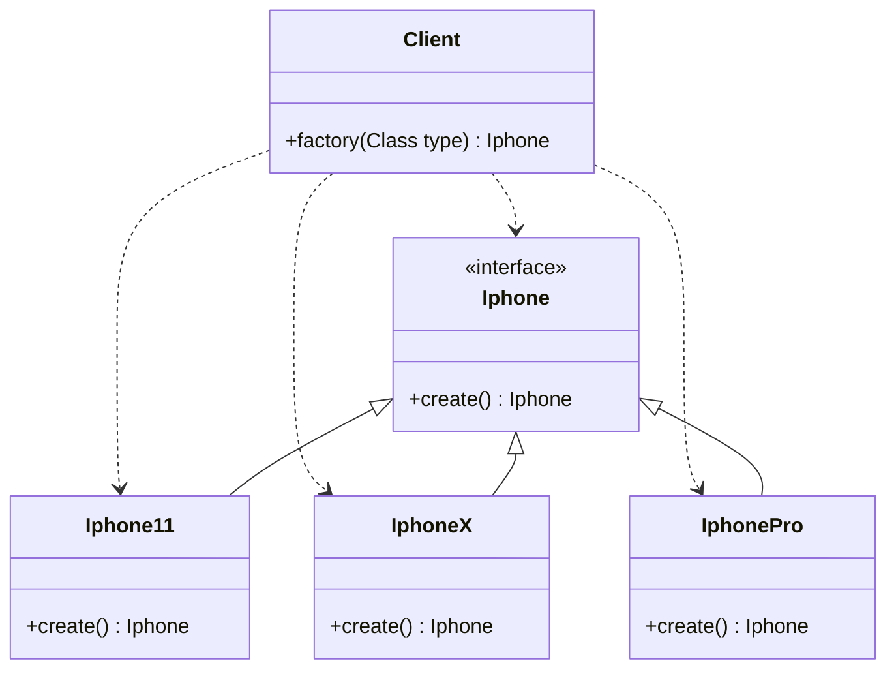
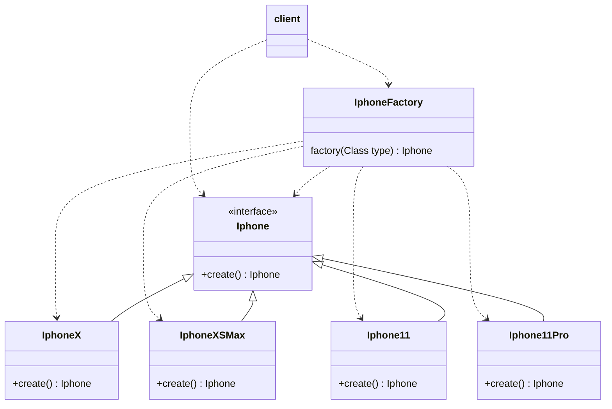
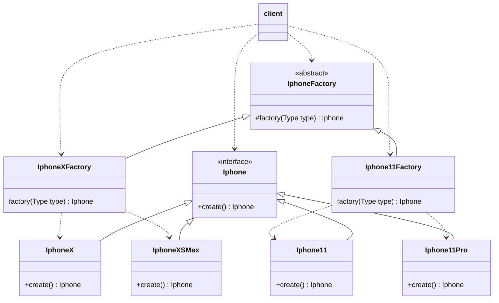
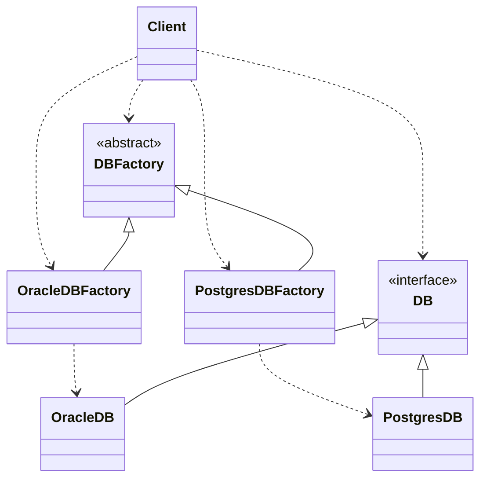
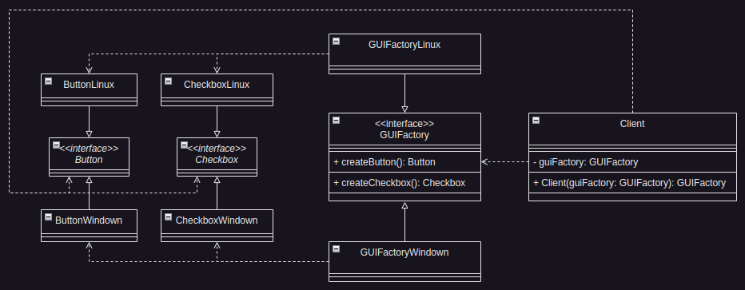
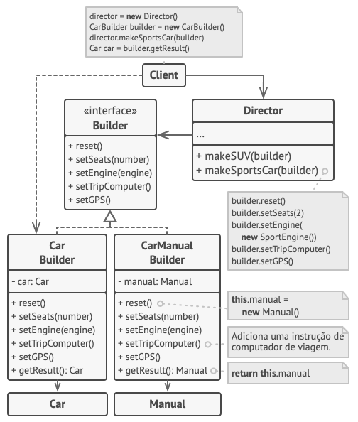

# Design Pattern
## 🏭 C R I A C I O N A I S
## ➔ Factory Method:
Outros nomes conhecidos: `Construtor virtual`

Defina uma (interface ou classe abstrata) para o "Produto", crie as diversas implementações concretas deste "produto", então defina um ou mais métodos factories, para retornar o objeto concreto desejado.
- __Importante lembrar as seguintes coisas básicas de OO__:
- - É regra básica de OO, que os tipos definidos devem ser sempre os mais abstratos possíveis. Pois você deve desenvolver toda a lógica da aplicação dependendo desses tipos abstratos.
- - Por isso que o método factory é apenas um coadjuvante para participar da construção de toda a regra de negócios da aplicação.
- - Por estes motivos devemos decidir o melhor lugar e forma de criar o método factory, onde faça mais sentido na participação da construção das lógicas subjacentes.
### Aplicado em:
Formas de criar objetos, de maneira "transparente" para a lógica do negócio.
### Problemas onde aplicar:
- __Problema 0__: Quando você tem uma classe com diversos métodos, e todos eles criam objetos semelhantes com configurações diferentes, você acaba encontrando muito código comum entre os métodos.
- __Problema 1__: Geralmente uma classe com um grande bloco de IFs que só tende a crescer, as vezes encapsulado em um método. Isso caracteriza um "problema chamado" simple factory, que nada tem haver com Factory Method ou qualquer padrão de projeto.
- __Problema 2__: Imagine que você tem uma Classe que faz integração com um serviço externo, e essa classe possui vários métodos, cada método representa uma nova comunicação com esse serviço externo, para cada nova comunicação um novo método é sempre criado.
### Receita geral de como aplicar:
- Cria-se uma interface ou classe abstrata com o comportamento comum do produto.
- Faz as diversas implementações.
- Um método factory é criado que determina qual classe concreta será instanciada.
- Este método factory pode ser implementado dentro da classe Cliente ou em uma classe específica para isso. Esse método factory pode ainda ser granulado, ou segmentado em grupos, dependendo da complexidade, pode ser um método factory para cada classe produto.
### Cenários de implementação do Factory, por complexidade:
- ~~Simples, onde a factory fica na própria classe cliente, como acima.~~
  - Quando a factory a ser criada é pequena e simples, e será usada somente naquela classe cliente.

[..> Dependencia, —|> Herança](https://mermaid.js.org/syntax/classDiagram.html) `[About Mermaid]`

- Simples, onde a factory fica em classe separada.
  - Quando a factory a ser criada ficou grande, e/ou será usado por vários clientes.

- Médio, se a factory crescer demais, podemos segmenta-la em grupos.
  - Quando se faz sentido criar uma classe factory para cada grupo das classes concretas relacionadas.

- Complexo, onde há uma classe factory para cada implementação concreta criada.
  - Quando a construção da factory para cada classe concreta é grande e complexa demais.

Obs.: O Factory Method é um padrão de projeto que se baseia em herança. Se você torná-lo estático, você não pode mais estendê-lo em subclasses, que é contrário ao propósito do padrão.

**_No padrão acima, abstraímos apenas um produto, quando precisamos abstrair mais de um produto, partimos para o próximo padrão, Fábrica Abstrata._**

## ➔ Abstract Factory:
Permite que você produza famílias de objetos relacionados sem ter que especificar suas classes concretas.
### Aplicado em:
...

### Problemas onde aplicar:
- __Problema 0__: Sua lógica de negócios precisa trabalhar com diversas famílias de produtos relacionados.
- __Problema 1__: Quando você tem uma classe com um conjunto de métodos fábrica que desfoquem sua responsabilidade principal.

### Receita geral de como aplicar:
- Defini-se uma interface ou classe abstrata para cada produto.
- Faz as implementações das diversas variantes de cada produto.
- Defina a interface para a abstract factory, com um método para cada produto da interface de produtos.
- Faz as implementações por familia de produtos.
- No inicio da execução da lógica, cria-se a factory concreta a ser usada no processo. A partir daí segue trabalhando com os tipos abstratos da factory e dos produtos.
### Cenário de implementação do Abstract Factory:

## ➔ Builder:
Construir objetos complexos passo a passo.
### Aplicado em:
...
### Problemas onde aplicar:
- __Problema 0__: Pode tentar resolver criando uma classe base, e várias subclasses dela. Isso gera muitas sub-classes.
- __Problema 1__: Tentativa de resolver com uma única classe, que possua um construtor com todos os parametros possíveis. Isso gerará instaciações confusas e com muitos nulls.
- __Problema 2__: Tentativa de resolver com uma única classe, com vários construtores, um para cada caso. Isso gerará uma quantidade grande de construtores.

### Receita geral de como aplicar:
- Extraia o código de construção do objeto para fora de sua própria classe.
- Mova para objetos separados chamados builders.
- O objeto não deve ser acessado enquanto está sendo construído.
- Para seguencias ordenadas da construção, podemos colocar em outra classe Diretor.
### Cenário de implementação do Builder:
- Simples, o builder é criado dentro da própria classe produto.

- Médio, onde tempos produtos que podem ser relacionados logicamente e podemos criar um builder comum a eles.

Fontes:

Readme.md:
https://raullesteves.medium.com/github-como-fazer-um-readme-md-bonit%C3%A3o-c85c8f154f8