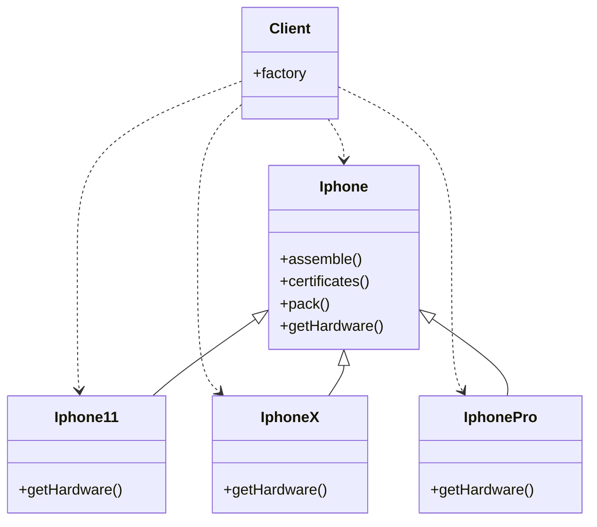

# Design Pattern
## 🏭 C R I A C I O N A I S
## Factory Method:
Define uma interface para criar um objeto, mas permite as classes decidem qual classe intanciar. Permite a uma classe deferir a instanciação para subclasses.
### Aplicado em:
Formas de criar os objetos.
### Problemas onde aplicar:
- Problema 1: Imagine que você tem uma Classe que faz integração com um serviço externo, e essa classe possui vários métodos, cada método representa uma nova comunicação com esse serviço externo, para cada nova comunicação um novo método é sempre criado.
### Receita geral de como aplicar:
- Cria-se uma interface ou classe abstrata com o comportamento comum.
- Faz as diversas implementações da interface.
- Um método factory é criado que determina qual classe concreta será instanciada.
- Este método factory pode ser implementado dentro da classe Cliente ou em uma classe específica para isso.

[..> Dependencia, —|> Herança](https://mermaid.js.org/syntax/classDiagram.html) `[About Mermaid]`

### Cenários de implementação do Factory:
- Se a factory crescer demais, podemos segmenta-la em grupos.