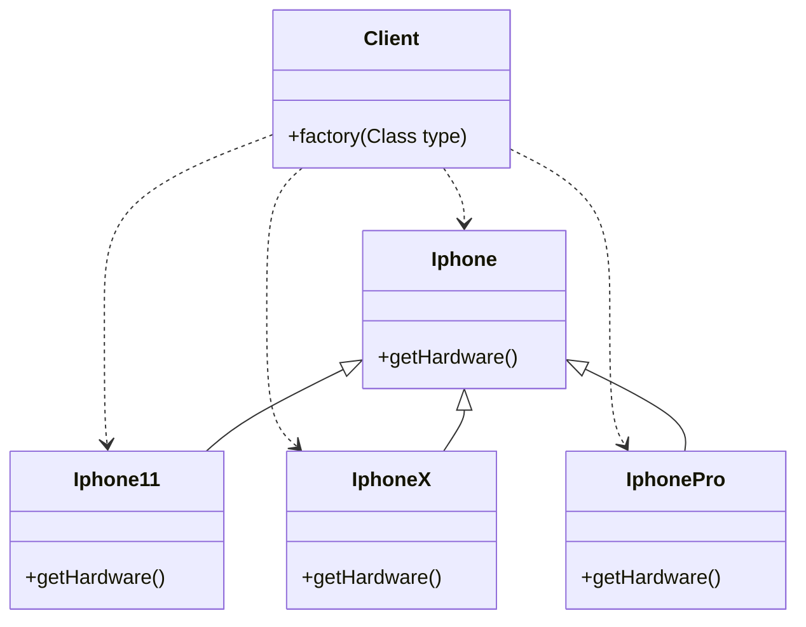
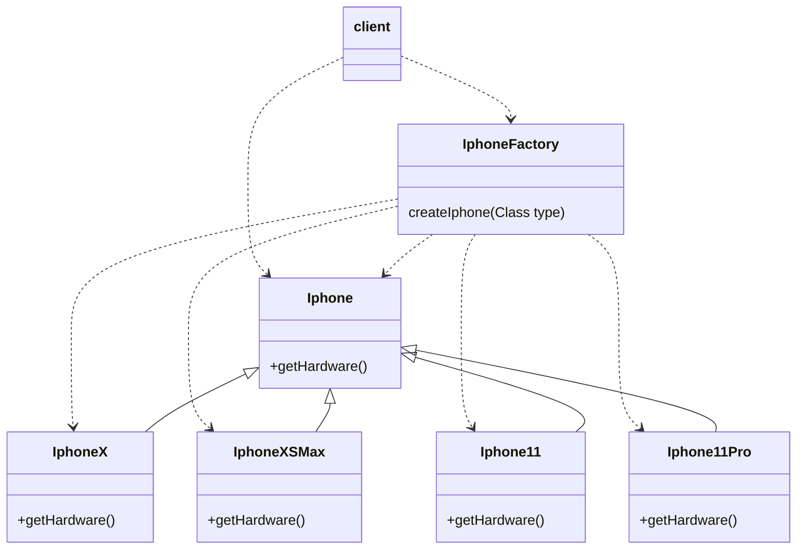
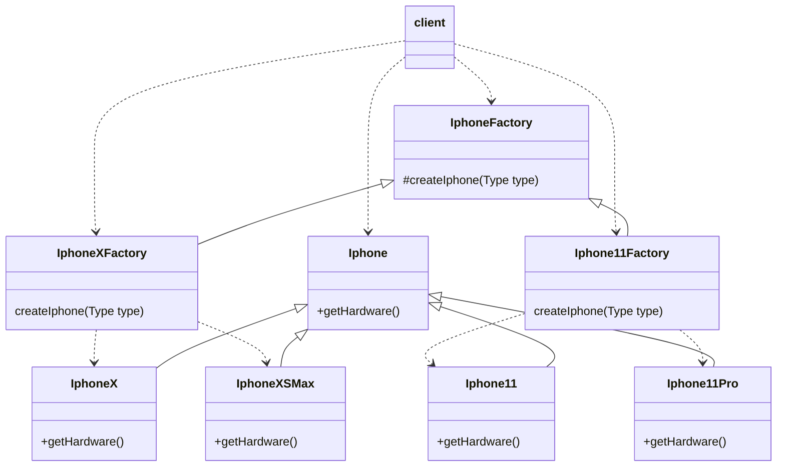
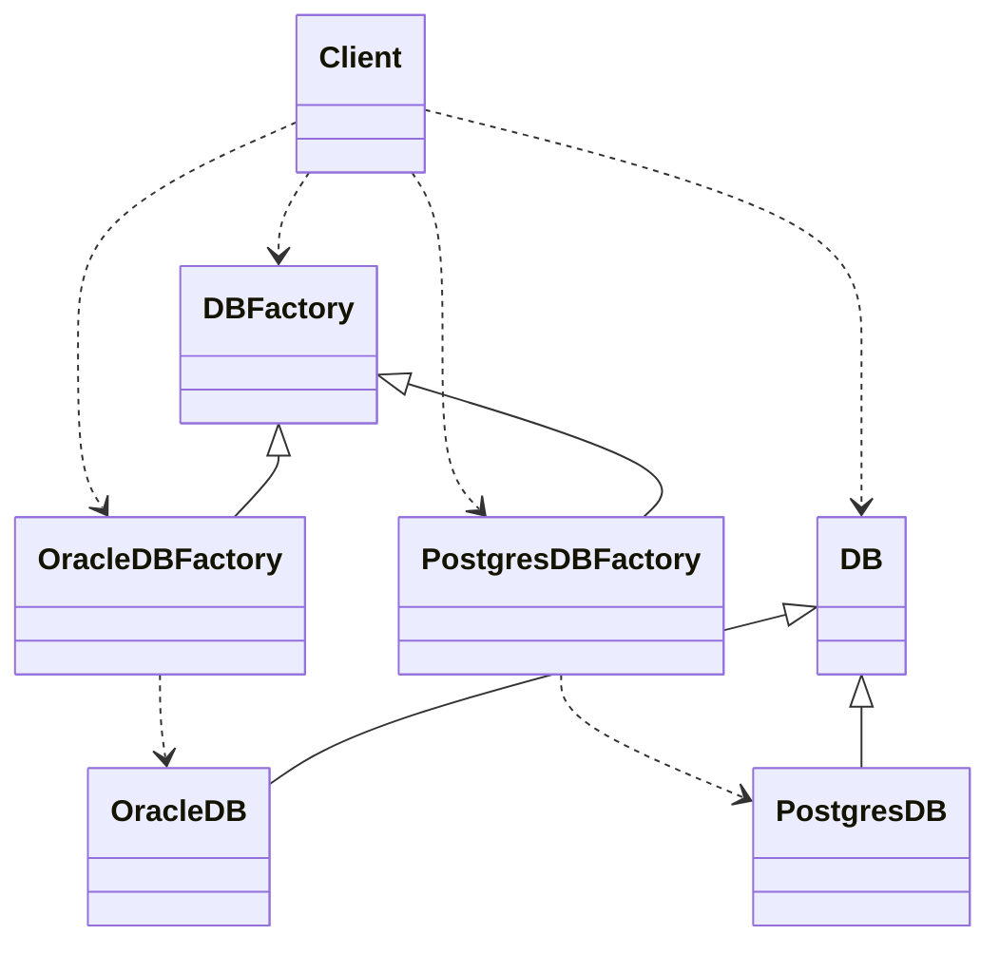

# Design Pattern
## 🏭 C R I A C I O N A I S
## ➔ Factory Method:
Outros nomes conhecidos: `Construtor virtual`

Define uma (interface ou classe abstrata) para o "produto", cria as diversas implementações concretas deste "produto", e define um ou mais métodos factories, para retornar o objeto concreto desejado, conforme alguma condição.
### Aplicado em:
Formas de criar os objetos.
### Problemas onde aplicar:
- __Problema 0__: Quando você tem uma classe com diversos métodos, e todos eles criam objetos semelhantes com configurações diferentes, você acaba encontrando muito código comum entre os métodos.
- __Problema 1__: Geralmente uma classe com um grande bloco de IFs que só tende a crescer, as vezes encapsulado em um método. Isso caracteriza um "problema chamado" simple factory, que nada tem haver com Factory Method ou qualquer padrão de projeto.
- __Problema 2__: Imagine que você tem uma Classe que faz integração com um serviço externo, e essa classe possui vários métodos, cada método representa uma nova comunicação com esse serviço externo, para cada nova comunicação um novo método é sempre criado.
### Receita geral de como aplicar:
- Cria-se uma interface ou classe abstrata com o comportamento comum.
- Faz as diversas implementações da interface ou classe abstrata.
- Um método factory é criado que determina qual classe concreta será instanciada.
- Este método factory pode ser implementado dentro da classe Cliente ou em uma classe específica para isso. Esse método factory pode ainda ser granulado, ou segmentado em grupos, dependendo da complexidade.
### Cenários de implementação do Factory, por complexidade:
- ~~Simples, onde a factory fica na própria classe cliente, como acima.~~
  - Quando a factory a ser criada é pequena e simples, e será usada somente naquela classe cliente.

[..> Dependencia, —|> Herança](https://mermaid.js.org/syntax/classDiagram.html) `[About Mermaid]`

- Simples, onde a factory fica em classe separada.
  - Quando a factory a ser criada ficou grande, e/ou será usado por vários clientes.

- Médio, se a factory crescer demais, podemos segmenta-la em grupos.
  - Quando se faz sentido criar uma classe factory para cada grupo das classes concretas relacionadas.

- Complexo, onde há uma classe factory para cada implementação concreta criada.
  - Quando a construção da factory para cada classe concreta é grande e complexa, com parametros únicos entre as factories.

Fontes:

Readme.md:
https://raullesteves.medium.com/github-como-fazer-um-readme-md-bonit%C3%A3o-c85c8f154f8